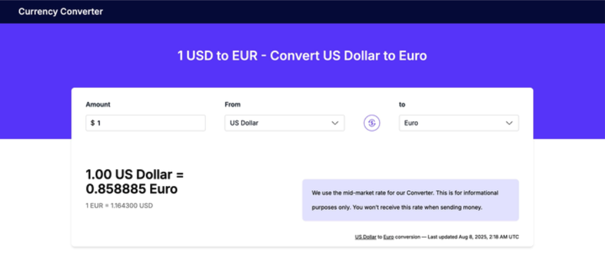

# IOL Challenge



Link al proyecto: [https://challenge-currency-converter.vercel.app](https://challenge-currency-converter.vercel.app)

## Índice

- [x] Instrucciones para usar la app
- [x] Información del stack
- [x] Uso de la IA
- [x] Conclusiones

## Instrucciones para usar la app
<details open>
  <summary>Click to expand/collapse</summary>
  
### Requisitos
- Node.js 18+
- pnpm (recomendado) — el proyecto usa `pnpm-lock.yaml`.

### Instalación

```bash
pnpm install
```

### Desarrollo

```bash
pnpm dev
```

La app estará disponible en `http://localhost:5173`. Las requests a la API se proxean automáticamente a `https://api.vatcomply.com` para evitar errores de CORS en localhost.

### Build de producción

```bash
pnpm build
pnpm preview
```

### Otros comandos

```bash
pnpm lint          # Corre ESLint
pnpm lint:fix      # Corrige errores automáticamente
pnpm format        # Formatea con Prettier
pnpm type-check    # Verifica tipos sin compilar
```
</details>


## Información del Stack
- react
- vite
- tailwindcss
- Typescript
- @tanstack/react-query
- vercel
- dayjs
- eslint & prettier

## Uso de la IA
- Partiendo de un analisis de los enpoints y las respuestas de la API y la definición de Goal adjunte contexto y lineamientos para el prompt inicial. No consideré necesario hacer explicito formateos o interfaces porque las respuestas de API ya eran lo suficientemente claras.
- Entre en modo plan de claude code adjuntando el prompt inicial y el PDF como referencia.
- Luego de una primera pasada del plan la primera iteración fue enfocada a estructura y orden de algunos elementos visuales y quitar funcionalidad innecesaria y agregué recomendaciones como el uso de Suspense.
- En segunda iteración confirmar uso de Suspense luego de evaluación y refinar menor la UI. Asumí que la referencia del PDF era suficiente pero hubo que iterar mejor pasando un screenshot específico.
- El paso a implementación del plan final tuvo varios steps donde hubo que iterar hasta lograr el resultado esperado
- Una vez cumplido el plan, por fuera de prompts y con funcionalidad base implementada corregí bugs y modifiqué algunas partes que se escaparon al momento del plan. Ejemplos: 
  - Seleccionar la misma currency, opté por que tome la misma funcionalidad del swap para ese caso. 
  - Algunas currencies no tienen rates, vienen con el objeto vacío y había que atajar ese caso
  - Sanitizar el input forzando sólo a poder colocar floats
  - Problema de CORS en local y prod para consumir el API externa
  - Cambios de maquetado para matchear exactamente con espacios y formas sugeridos en el diseño
- Una vez finalizado, se corrieron el skill de review y react-doctor donde arrojaron cambios y mejoras mínimas como evitar el auto foco, el skeleton que no matcheaba con la estructura base y generaba saltos y efectos indeseados.
- Se utilizó Sonnet 4.6 en plan PRO. En términos de uso la planificación e implementación se completaron dentro de una sola sesión de contexto. El costo total fue mayor debido a la regeneración de los archivos de prompts y planes intermedios que se perdieron al iniciar el proyecto (ver Aclaraciones)
--

## Conclusiones

### Aclaraciónes
Al momento de pasar a implementar utilice una skill propia que sirve como kick-off del proyecto y scaffoldea varios stacks según necesidad, el problema es que al iniciarlo vació la carpeta con los archivos con prompts y los planes intermedios donde se desprendía la justifiación de las iteraciónes. Intenté regenerarlos desde el contexto de la sesión y es lo que está listado en /prompts pero me parecía pertinente aclararlo por si algúna comparativa no esta clara.

### Justificación del Stack
- El uso de **react** fue requerido en las instrucciones del challenge
- Al ser una app pequeña un bundler rápido y cómodo es **Vite**, nextjs se sentía un overkill para esta implementación
- El uso de **tailwind** es por su velocidad de desarrollo, liviano y estandar en la industria.
- **React Query**, al principio dudé porque realmente no era necesario el uso pero facilita mucho la integración de los fetch con los estados de componentes, el manejo errores y loading con suspense. También ahorra llamadas innecesarias en momentos concretos y por eso terminé agregandola.
- Se utilizó **Vercel** como host provider por la facilidad de integración y precio.
- **Dayjs** también dudé por que no quería cargar el bundle final innecesariamente pero ahorró muchos formateos y legibilidad del código.
- **Typescript** Parte del stack base, necesario para definir interfaces y trabajar dentro de un marco seguro. 
- **eslint** y **prettier** a nivel desarrollo lo utizo siempre para comodidad personal y trabajar colaborativamente agregando orden y reglas básicas.
- La estructura de carpetas y nombres de archivo quedaron lo mas "flat" posible para no complejizar el arbol. Como gusto personal en proyectos mas grandes suelo utlizar `/NombreComponente/index.tsx` donde al tener la carpeta uno puede separar types, componentes internos, test etc. pero me pareció que agregaba complejidad para este caso. 

### Caché de react query
Al ser una app pensada para rates es importante tener el dato lo mas actualizado posible pero me pareció valioso agregar el caché corto de 30 segundos por que ahorra llamadas de clicks repetidos en el corto lapso de tiempo. No es algo super necesario pero me pareció un buen detalle ahorrar esos request y no termina afectando la veracidad del dato. Mientas que el listado de currencies tiene sentido mantenerlo durante la sesión ya que no va a cambiar y no tiene rates variables asociados.